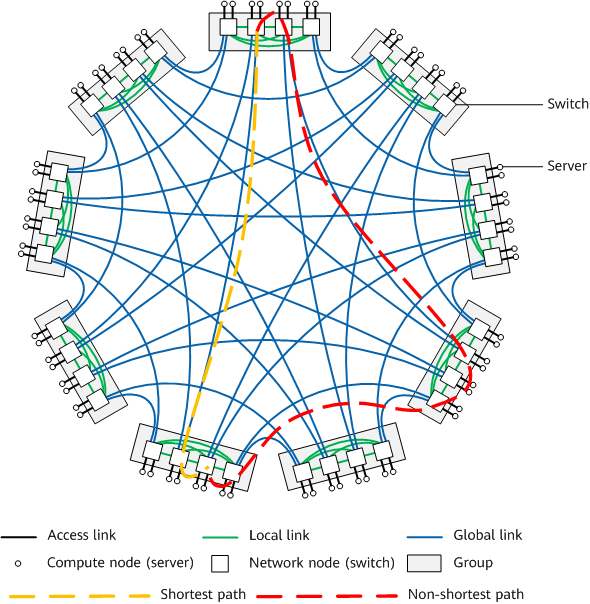
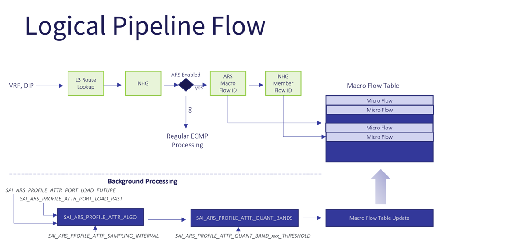
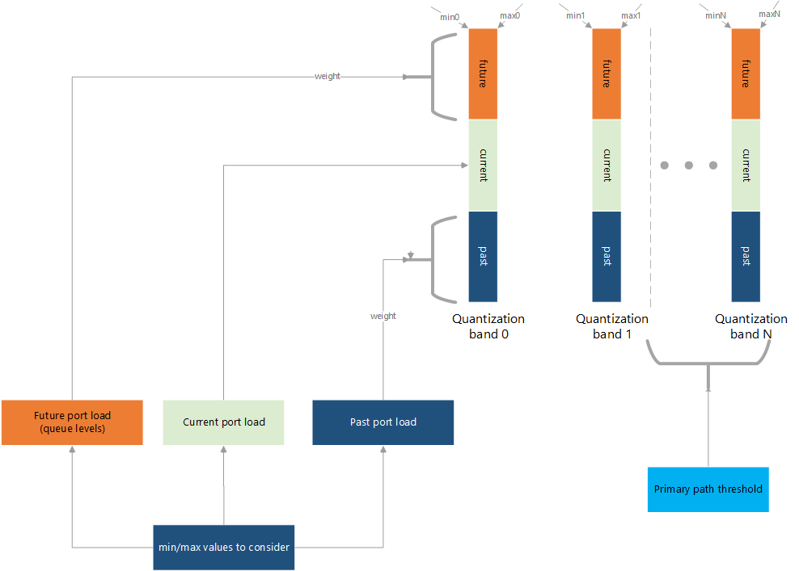
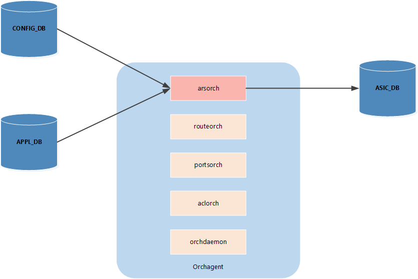
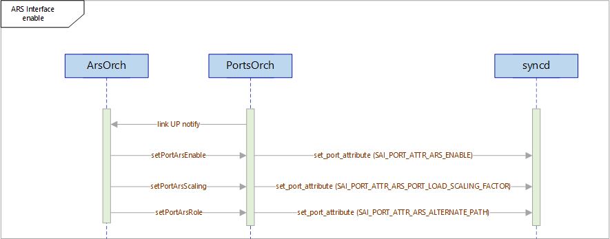
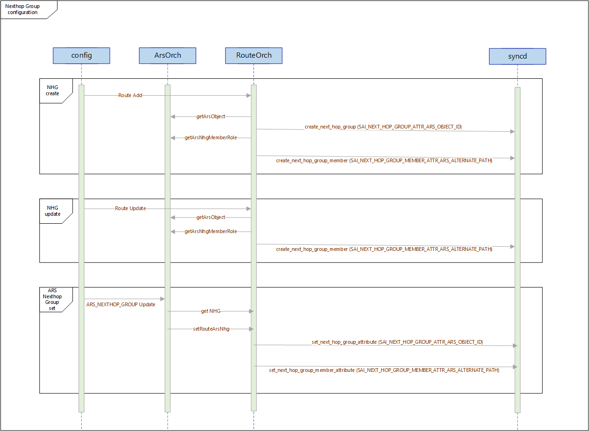
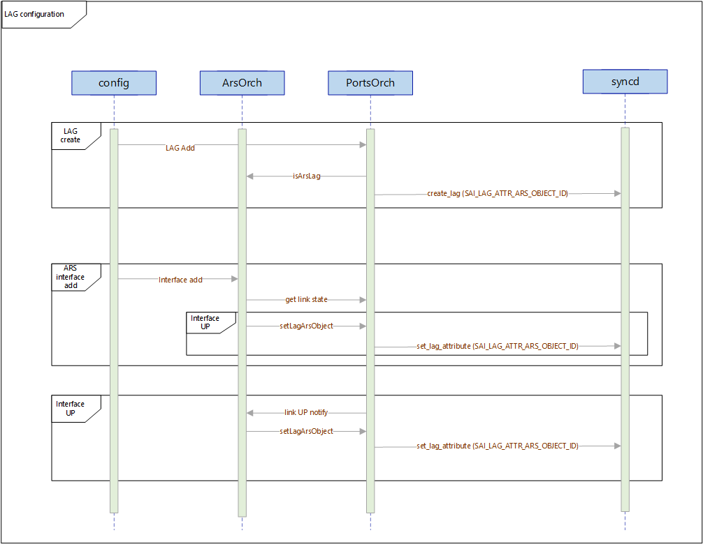

# Local ARS HLD #

## Table of Content 

- [Revision](#revision)
- [Definitions/Abbreviations](#definitionsabbreviations)
- [Scope](#scope)
- [Overview](#overview)
- [Requirements](#requirements)
- [High Level Design](#high-level-design)
- [CLI/YANG model Enhancements](#cliyang-model-enchancements)
- [Config DB Enhancement](#config-db-enhancement)

### Revision  

| Revision | Date        | Author           | Change Description |
| -------- | ----------- | ---------------- | ------------------ |
| 1.0      | Dec 01 2024 | Vladimir Kuk     | Initial proposal   |

### Definitions/Abbreviations 

| Definitions/Abbreviation | Description |
| ------------------------ | ----------- |
| ARS | Adaptive Routing and Switching |
| NHG | Nexthop Group |
| ECMP | Equal Cost MultiPath |

### Scope

This high-level design document describes the implementation for Local ARS in SONiC.

### Overview 

**Existing Forwarding Decision Model**

Today, the routing protocol or SDN controller decides the reachability of a given destination and finds all possible paths. These paths may be equal cost or unequal cost. The decision to choose of one the paths from all available paths is done in the switch pipeline based on a computed hash. This path selection is static in nature based on the packet fields. Hash based selection doesn't take into account the dynamic state of the local or end-to-end path.

Control plane protocols exist for traffic engineering paths, but involves control plane decisions that are very slow to react to changing traffic patterns in the network or state of interfaces.

Adaptive Routing System (ARS) allows dynamic selections of the best available path for data packets based on real-time network conditions. This approach helps to mitigate congestion, optimize resource utilization, and improve overall network performance.

No standard exists, but there is an industry consensus for general approach.

The following illustrates the common operation of ARS, in which two paths are considered - one shortest (minimal) and another (non-minimal), when forwarding traffic to the destination. When shortest path becomes congested, the alternative will be used.

__Figure 1: ARS in direct topology__<br>



ARS can be divided into two parts:
- Local ARS - Scope of this HLD, focuses on dynamic path selection within a single device. It enables more granular control over routing decisions by considering the real-time utilization of local egress ports. This is achieved by monitoring local port utilization, identifying micro flows inside of incoming macro flow and assigning best available path.
- Global ARS - focuses on selecting non-congested path to end host by exchanging ports utilization data, between remote devices.

This design follows SAI conceptual model described in https://github.com/opencomputeproject/SAI/blob/master/doc/ARS/Adaptive-Routing-and-Switching.md.


The diagram illustrates a Conceptual Packet Flow, where macro flows are collections of multiple micro flows that share the same routing destination. Micro flows, identified by a 5-tuple (source IP, destination IP, protocol, source port, destination port), are hashed, and if several micro flows hash to the same bucket, they are grouped into a macro flow. These flows are further segmented into flow-lets based on idle time thresholds between packets. A Macro Flow Table maps these flows to next-hop destinations and tracks their status (e.g., "active" or "expired"). Using Adaptive Routing within an ECMP group, the system dynamically assigns traffic based on link quality metrics like latency and packet loss.

__Figure 2: ARS Packet Flow__

This diagram outlines a Logical Pipeline Flow for Adaptive Routing with ARS. Flow starts with L3 Route Lookup to identify the appropriate Next-Hop Group (NHG). If ARS is enabled, the system generates an ARS Macro Flow ID and assigns packets to specific next-hop destinations using a Macro Flow Table. Otherwise, traffic undergoes standard ECMP processing. In the background, ARS monitors port load metrics (past and future) and updates the Macro Flow Table using adaptive algorithms and quality thresholds to ensure optimal traffic distribution based on real-time link conditions.

__Figure 3: ARS SAI Pipeline Flow__


The following diagram adds a few details to the SAI pipeline to illustrate the decision-making process.

__Figure 4: Path quality__


### Requirements

1. Support different ARS modes:
    - Flowlet-based port selection
    - Per packet port selection
2. Support enabling ARS over NHG or LAG
3. Support path quality configuration
4. Support ACL action to disable ARS 

### Architecture Design 

The following orchestration agents will be added or modified. The flow diagrams are captured in a later section.


__Figure 5: Orchestration agents__

#### ArsOrch
arsorch - it is an orchestration agent that handles the configuration requests from CONFIG_DB or APPL_DB. It is responsible for creating the SAI ARS profile and configuring SAI ARS object.

#### Orchdaemon
orchdaemon - it is the main orchestration agent, which handles all Redis DB's updates, then calls appropriate orchagent, the new arsorch should be registered inside the orchdaemon.

#### RouteOrch
routeOrch monitors operations on Route related tables in APPL_DB and converts those operations in SAI commands to manage IPv4/IPv6 route and nexthops. New functionality for quering and configuring ARS-enabled NHG.

#### PortsOrch
portsorch handles all ports-related configurations. New functionality for enabling ARS on ports.

#### AclOrch
aclorch is used to deal with configurations of ACL table and ACL rules. New rule action for control ARS operation.


### High-Level Design 

#### Sequence diagrams

__Figure 6: Initilization__


__Figure 7: Interface enable__



__Figure 8: Nexthop group configuration__



__Figure 9:LAG configuration__



__Figure 10:ACL configuration__


New orchagent: ArsOrch responsible for 
1. Creating/Updating ARS profile 
2. Enable interfaces for ARS
3. Enable ARS over nexthop group
4. Allow configuration of path metrics
5. Disabling ARS with ACL action

### SAI API 

No new SAI apis or attributes.

SAI usage and supported attributes:

| SAI api | Supported SAI attribute |
| ---------------- | ----------------------- |
|create_ars_profile | SAI_ARS_PROFILE_ATTR_PORT_LOAD_PAST<br>SAI_ARS_PROFILE_ATTR_PORT_LOAD_PAST_WEIGHT<br>SAI_ARS_PROFILE_ATTR_PORT_LOAD_FUTURE<br>SAI_ARS_PROFILE_ATTR_PORT_LOAD_FUTURE_WEIGHT<br>SAI_ARS_PROFILE_ATTR_QUANT_BANDS<br>SAI_ARS_PROFILE_ATTR_QUANT_BAND_0_MIN_THRESHOLD ... SAI_ARS_PROFILE_ATTR_QUANT_BAND_7_MIN_THRESHOLD<br>SAI_ARS_PROFILE_ATTR_QUANT_BAND_0_MAX_THRESHOLD ... SAI_ARS_PROFILE_ATTR_QUANT_BAND_7_MAX_THRESHOLD<br>SAI_ARS_PROFILE_ATTR_ENABLE_IPV4<br>SAI_ARS_PROFILE_ATTR_ENABLE_IPV6<br>SAI_ARS_PROFILE_ATTR_LOAD_PAST_MIN_VAL<br>SAI_ARS_PROFILE_ATTR_LOAD_PAST_MAX_VAL<br>SAI_ARS_PROFILE_ATTR_LOAD_FUTURE_MIN_VAL<br>SAI_ARS_PROFILE_ATTR_LOAD_FUTURE_MAX_VAL<br>SAI_ARS_PROFILE_ATTR_LOAD_CURRENT_MIN_VAL<br>SAI_ARS_PROFILE_ATTR_LOAD_CURRENT_MAX_VAL<br>SAI_ARS_PROFILE_ATTR_MAX_FLOWS<br>SAI_ARS_PROFILE_ATTR_SAMPLING_INTERVAL|
|create_ars | SAI_ARS_MODE_FLOWLET_QUALITY<br>SAI_ARS_MODE_PER_PACKET_QUALITY<br>SAI_ARS_ATTR_IDLE_TIME<br>SAI_ARS_ATTR_MAX_FLOWS<br>SAI_ARS_ATTR_PRIMARY_PATH_QUALITY_THRESHOLD
|set_port_attribute|SAI_PORT_ATTR_ARS_ENABLE<br>SAI_PORT_ATTR_ARS_PORT_LOAD_SCALING_FACTOR<br>SAI_PORT_ATTR_ARS_ALTERNATE_PATH|
|create_next_hop_group|SAI_NEXT_HOP_GROUP_ATTR_ARS_OBJECT_ID<br>SAI_NEXT_HOP_GROUP_MEMBER_ATTR_ARS_ALTERNATE_PATH
|create_acl_entry|SAI_ACL_ACTION_TYPE_DISABLE_ARS_FORWARDING
|set_lag_attribute|SAI_LAG_ATTR_ARS_OBJECT_ID

### Configuration and management 

#### YANG model Enhancements 

##### ARS_PROFILE

```
    container ARS_PROFILE {

		list ARS_PROFILE_LIST {

			key "profile_name";
			max-elements 1;

			leaf profile_name {
				description "ARS Profile Name";
				type string;
			}

			leaf algorithm {
				description "ARS quality algorithm";
				type enumeration {
					enum ewma {
						description "Exponentially Weighted Moving Average algorithm";
					}
				}
			}

			leaf max_flows {
				type uint32;
				description  "Maximum number of flows that can be maintained per ARS profile.";
			}

			leaf sampling_interval {
				type uint32;
				description  "Sampling interval in microseconds for quality measure computation.";
			}

			leaf past_load_min_value {
				type uint16;
				description "Past load min value.";
			}

			leaf past_load_max_value {
				type uint16;
				description "Past load max value.";
			}

			leaf past_load_weight {
				type uint16;
				description "Past load weight.";
			}

			leaf future_load_min_value {
				type uint16;
				description "Future load min value.";
			}
			leaf future_load_max_value {
				type uint16;
				description "Future load max value.";
			}

			leaf future_load_weight {
				type uint16;
				description "Future load weight.";
			}

			leaf current_load_min_value {
				type uint16;
				description "Current load min value.";
			}

			leaf current_load_max_value {
				type uint16;
				description "Current load max value.";
			}

			leaf ipv4_enable {
				type boolean;
				description "Whether ARS is enabled over IPv4 packets";
			}

			leaf ipv6_enable {
				type boolean;
				description "Whether ARS is enabled over IPv6 packets";
			}
		}
		/* end of list ARS_PORIFLE_LIST */
	}
	/* end of container ARS_PORIFLE */
```
##### ARS_QUANTIZATION_BANDS
```
	container ARS_QUANTIZATION_BANDS {

		list ARS_QUANTIZATION_BANDS_LIST {
			key "profile_name band_index";
			max-elements 8;

			leaf profile_name {
				description "ARS profile Name";
				type leafref {
					path "/sars:sonic-ars/sars:ARS_PROFILE/sars:ARS_PROFILE_LIST/sars:profile_name";
				}
			}

			leaf band_index {
				type uint8;
				description "Index of the qunatization band";
			}

			leaf min_value {
				type uint16;
				description "Minimum value in Mbps to use for the qunatization band creation";
			}

			leaf max_value {
				type uint16;
				description "Minimum value in Mbps to use for the qunatization band creation";
			}
		}
		/* end of list ARS_QUANTIZATION_BANDS_LIST */
	}
	/* end of container ARS_QUANTIZATION_BANDS */
```

##### ARS_OBJECT

```
	container ARS_OBJECT {

		list ARS_OBJECT_LIST {
			key "profile_name ars_name";

			leaf profile_name {
				description "ARS profile Name";
				type leafref {
					path "/sars:sonic-ars/sars:ARS_PROFILE/sars:ARS_PROFILE_LIST/sars:profile_name";
				}
			}

			leaf ars_name {
				description "ARS object Name";
				type string;
			}

			leaf assign_mode {
				type enumeration {
					enum per_flowlet_quality{
						description "Per flow-let assignment based on flow quality";
					}
					enum per_packet {
						description "Per packet flow assignment based on port load";
					}
				}
			}

			leaf flowlet_idle_time {
				type uint16;
				description  "Idle duration in microseconds. This duration is to classifying a flow-let in a macro flow.";
			}

			leaf max_flows {
				type uint32;
				description  "Maximum number of flow states that can be maintained per ARS object.";
			}

			leaf primary_path_threshold {
				type uint32;
				description  "Primary path metric";
			}

			leaf alternative_path_cost {
				type uint32;
				description  "Alternative path cost";
			}
		}
		/* end of list ARS_OBJECT_LIST */
	}
	/* end of container ARS_OBJECT */
```

##### ARS_INTERFACE

```
    container ARS_INTERFACE {

        list ARS_INTERFACE_LIST {
            description  "List of interfaces participating in ARS";
            key "if_name";

            leaf if_name {
                type union {
                    type leafref {
                        path "/port:sonic-port/port:PORT/port:PORT_LIST/port:name";
                    }
                    type leafref {
                        path "/lag:sonic-portchannel/lag:PORTCHANNEL/lag:PORTCHANNEL_LIST/lag:name";
                    }
                }
                description "ARS-enabled interface name";
            }
        }
        /* end of list ARS_INTERFACE_LIST */
    }
    /* end of container ARS_INTERFACE */
```

##### ARS_NEXTHOP_GROUP

```
    container ARS_NEXTHOP_GROUP {

        description "ARS-enabled Nexthop Groups";

        list ARS_NEXTHOP_GROUP_LIST {

            key "ip_prefix vrf_name";

            leaf ip_prefix{
                type stypes:sonic-ip-prefix;
                description "Ip prefix which identifies nexthop group for which ARS behavior is desired";
            }

            leaf vrf_name {
                type union {
                    type string {
                        pattern "default";
                    }
                    type leafref {
                        path "/vrf:sonic-vrf/vrf:VRF/vrf:VRF_LIST/vrf:name";
                    }
                }
                description "VRF name";
            } 

            leaf ars_name{
                type leafref {
                    path "/sars:sonic-ars/sars:ARS_OBJECT/sars:ARS_OBJECT_LIST/sars:ars_name";
                }
                mandatory true;
                description "ARS object name that bound to this NHG";
            }

            leaf-list alternative_path_members {
                type inet:ip-address;
                description "NHG members participating in alternative path";
            }
        }
        /* end of list ARS_NEXTHOP_GROUP_LIST */
    }
    /* end of container ARS_NEXTHOP_GROUP */
```

##### ARS_PORTCHANNEL

```
    container ARS_PORTCHANNEL {

        description "ARS-enabled LAGs";

        list ARS_PORTCHANNEL_LIST {

            key "if_name";

            leaf if_name{
                type leafref {
                    path "/lag:sonic-portchannel/lag:PORTCHANNEL/lag:PORTCHANNEL_LIST/lag:name";
                }
                description "Interface name which identifies LAG for which ARS behavior is desired";
            }

            leaf ars_name{
                type leafref {
                    path "/sars:sonic-ars/sars:ARS_OBJECT/sars:ARS_OBJECT_LIST/sars:ars_name";
                }
                mandatory true;
                description "ARS object name that bound to this LAG";
            }

            leaf-list alternative_path_members {
				type leafref {
					path "/port:sonic-port/port:PORT/port:PORT_LIST/port:name";
				}
                description "Members of the LAG participating in alternative path";
            }
        }
        /* end of list ARS_PORTCHANNEL_LIST */
    }
    /* end of container ARS_PORTCHANNEL */

```

##### ACL_RULE changes

```
    container sonic-acl {

        container ACL_RULE {

            description "ACL_RULE part of config_db.json";

            list ACL_RULE_LIST {

                key "ACL_TABLE_NAME RULE_NAME";

                leaf ACL_TABLE_NAME {
                    type leafref {
                        path "/acl:sonic-acl/acl:ACL_TABLE/acl:ACL_TABLE_LIST/acl:ACL_TABLE_NAME";
                    }
                }

                leaf RULE_NAME {
                    type string {
                        length 1..255;
                    }
                } 
...
                leaf DISABLE_ARS_FORWARDING {
                    description "Disable ARS forwarding on matching packets";
                    type boolean;
                    default false;
                }
            }
         }
    }
```

#### Config DB Enhancements  

```
; New container ARS_PROFILE_TABLE
; ARS global configuration

key                     = ARS_PROFILE|profile_name

;field                  = value

algorithm               = "ewma"        ;Path quality calculation algorithm
max_flows               = uint32        ;Maximum number of flows that can be maintained for ARS
sampling_interval       = uint32        ;Sampling interval in microseconds
past_load_min_value     = uint16        ;Minimum value of Past load range.
past_load_max_value     = uint16        ;Maximum value of Past load range.
past_load_weight        = uint16        ;Weight of the past load
future_load_min_value   = uint16        ;Minimum value of Future load range.
future_load_max_value   = uint16        ;Maximum value of Future load range.
future_load_weight      = uint16        ;Weight of the future load
current_load_min_value  = uint16        ;Minimum value of Current load range.
current_load_max_value  = uint16        ;Maximum value of Current load range.
ipv4_enable             = boolean       ;Whether ARS is enabled over IPv4 packets
ipv6_enable             = boolean       ;Whether ARS is enabled over IPv6 packets


Configuration exmaple:

"ARS_PROFILE": {
	"default": {
		"algorithm": "ewma",
		"max_flows" : 512,
		"sampling_interval": 10,
		"past_load_min_value" : 0,
		"past_load_max_value" : 100,
		"past_load_weight": 1,
		"future_load_min_value" : 0,
		"future_load_max_value" : 1000,
		"future_load_weight": 5.
		"ipv4_enable" : "true",
		"ipv6_enable" : "true"
	}
}
```
```
; New table ARS_QUANTIZATION_BANDS_TABLE
; ARS path quality quantization configuration
key                     = ARS_QUANTIZATION_BANDS|profile_name|band_index
;field                  = value
min_value           = uint16            ;Minimum value for this quantization band
max_value           = uint16            ;Maximum value for this quantization band
Configuration exmaple:
"QUANTIZATION_BANDS": {
	"default|0": {
            "min_value" : 0,
            "max_value" : 100
	}
        },
""QUANTIZATION_BANDS": {
	"default|1": {
            "min_value" : 100,
            "max_value" : 200
    }
}
```

```
; New table ARS_OBJECT_TABLE
; ARS object configuration

key                     = ARS_OBJECT|ars_name

;field                    = value

assign_mode               = "per_flowlet_quality" / "per_packet"  ;port selection assignment mode
flowlet_idle_time         = uint16                                ;idle time for decting flowlet in macro flow. Relevant only for assign_mode=pre_flowlet
max_flows                 = uint16                                ;Max number of flows supported for ARS
primary_path_threshold	= uint16                                ;Quality threshold for primary path 
    alternative_path_cost = uint16                                ;Cost of switching to alternative path

Configuration exmaple:

"ARS_OBJECT" {
	"flowlet_based": {
		"assign_mode" : "per_flowlet_quality",
		"flowlet_idle_time" : 256,
		"max_flows" : 512,
		"primary_path_threshold" : 100,
		"alternative_path_cost": 250
	}
}

```

```
; New table ARS_INTERFACE_TABLE
; ARS interfaces configuration

key                     = ARS_INTERFACE|ars_name|if_name     ;ifname is the name of the ARS-enabled interface

Configuration exmaple:

"ARS_INTERFACE": {
    "flowlet-based | Ethernet0" : {},
    "flowlet-based | Ethernet8" : {}
}
```

```
; New table ARS_NEXTHOP_GROUP_TABLE
; Nexhop groups enabled for ARS

key                     = ARS_NEXTHOP_GROUP|ip_prefix|vrf_name    ;Route prefix identifing nexhop-group 

;field                  = value
ars_name                = string                                  ;ARS object name
alternative_path_members = inet-address             ;Alternative path members address

Configuration exmaple:

"ARS_NEXTHOP_GROUP": {
    "192.168.0.100/32|default" : {
        "ars_name" : "flowlet-based",
        "alternative_path_members": {"1.1.1.1", "2.2.2.2"}
    }
}
```

```
; New table ARS_PORTCHANNEL_TABLE
; LAGs enabled for ARS

key                     = ARS_PORTCHANNEL|if_name    ;Interface name identifing LAG 

;field                  = value
ars_name                = string                     ;ARS object name
alternative_path_members = string                   ;Members of the LAG participating in alternative path

Configuration exmaple:

"ARS_PORTCHANNEL": {
    "PortChannel1" : {
		"ars_name" : "flowlet-based",
		"alternative_path_members": {"Ethernet0", "Ethernet10"}
    }
}
```

```
; Existing table ACL_RULE_TABLE
; ACL action for disabling ARS


key                     = ACL_RULE|ACL_TABLE_NAME|RULE_NAME

;field                  = value
DISABLE_ARS_FORWARDING  = boolean                   ;ARS operation disabled on matching packets

Configuration example:

"ACL_RULE": {
    "ACL_ALL|NO_ARS" : {
        "DISABLE_ARS_FORWARDING" : "true"
    }
}
```


#### Appl DB Enhancements  

```
; New container ARS_PROFILE_TABLE
; ARS global configuration

key                     = ARS_PROFILE_TABLE:profile_name

;field                  = value

algorithm               = "ewma"        ;Path quality calculation algorithm
max_flows                 = uint32       ;Maximum number of flows that can be maintained for ARS
sampling_interval         = uint32       ;Sampling interval in microseconds
past_load_min_value     = uint16        ;Minimum value of Past load range.
past_load_max_value     = uint16        ;Maximum value of Past load range.
past_load_weight        = uint16        ;Weight of the past load
future_load_min_value   = uint16        ;Minimum value of Future load range.
future_load_max_value   = uint16        ;Maximum value of Future load range.
future_load_weight      = uint16        ;Weight of the future load
current_load_min_value  = uint16        ;Minimum value of Current load range.
current_load_max_value  = uint16        ;Maximum value of Current load range.
ipv4_enable               = boolean      ;Whether ARS is enabled over IPv4 packets
ipv6_enable               = boolean      ;Whether ARS is enabled over IPv6 packets
```


```
; New table ARS_QUANTIZATION_BANDS_TABLE
; ARS path quality quantization configuration

key                     = ARS_QUANTIZATION_BANDS_TABLE:profile_name:band_index

;field                  = value

min_value           = uint16            ;Minimum value for this quantization band
max_value           = uint16            ;Maximum value for this quantization band
```

```
; New table ARS_OBJECT_TABLE
; ARS object configuration

key                     = ARS_OBJECT_TABLE:ars_name

;field                    = value

assign_mode               = "per_flowlet_quality" / "per_packet"  ;port selection assignment mode
flowlet_idle_time         = uint16                                ;idle time for decting flowlet in macro flow. Relevant only for assign_mode=pre_flowlet
max_flows                 = uint16                                ;Max number of flows supported for ARS
primary_path_threshold	= uint16                                ;Quality threshold for primary path 
    alternative_path_cost = uint16                                ;Cost of switching to alternative path

```

```
; New table ARS_INTERFACE_TABLE
; ARS interfaces configuration

key                     = ARS_INTERFACE_TABLE:ars_name:if_name     ;ifname is the name of the ARS-enabled interface

```

```
; New table ARS_NEXTHOP_GROUP_TABLE
; Nexhop groups enabled for ARS

key                     = ARS_NEXTHOP_GROUP_TABLE:ip_prefix:vrf_name    ;Route prefix identifing nexhop-group 

;field                  = value
ars_name                = string                           ;ARS object name

```

```
; New table ARS_PORTCHANNEL_TABLE
; LAGs enabled for ARS

key                     = ARS_PORTCHANNEL_TABLE:if_name    ;Interface name identifing LAG 

;field                  = value
ars_name                = string                           ;ARS object name

```

```
; Existing table ACL_RULE_TABLE
; ACL action for disabling ARS


key                     = ACL_RULE_TABLE:table_name:rule_name

;field                  = value
DISABLE_ARS_FORWARDING  = boolean                          ;ARS operation disabled on matching packets

```
### Counters
Following counters defined in SAI and will be supported via FlexCounters:
| Level | Supported SAI counters |
| ---------------- | ----------------------- |
|lag | SAI_LAG_ATTR_ARS_PACKET_DROPS<br>SAI_LAG_ATTR_ARS_PORT_REASSIGNMENTS
| nexthop group|SAI_NEXT_HOP_GROUP_ATTR_ARS_PACKET_DROPS<br>SAI_NEXT_HOP_GROUP_ATTR_ARS_NEXT_HOP_REASSIGNMENTS<br>SAI_NEXT_HOP_GROUP_ATTR_ARS_PORT_REASSIGNMENTS|

### Warmboot and Fastboot Design Impact  

Warmboot for SWSS container will be supported.

### Memory Consumption
This sub-section covers the memory consumption analysis for the new feature: no memory consumption is expected when the feature is disabled via compilation and no growing memory consumption while feature is disabled by configuration. 

### Restrictions/Limitations

Due to hw resources allocations, all ARS configuration must be done prior to routing configuration.???????????

### Testing Requirements/Design  
Explain what kind of unit testing, system testing, regression testing, warmboot/fastboot testing, etc.,
Ensure that the existing warmboot/fastboot requirements are met. For example, if the current warmboot feature expects maximum of 1 second or zero second data disruption, the same should be met even after the new feature/enhancement is implemented. Explain the same here.
Example sub-sections for unit test cases and system test cases are given below. 

#### Unit Test cases  

#### System Test cases

### Open/Action items - if any 

* ACL ARS enable
* ACL ARS monitoring
* Samplepacket binding
* CLI commands


