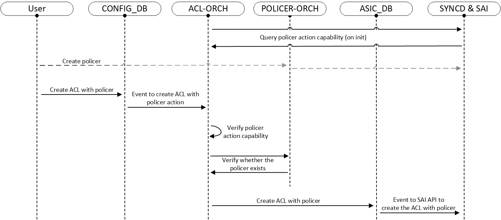

# Policy Based Metering

### Table Of Content
- [Policy Based Metering](#policy-based-metering)
    - [Table Of Content](#table-of-content)
    - [Revision](#revision)
    - [Scope](#scope)
      - [Out of Scope](#out-of-scope)
    - [Definitions/Abbreviations](#definitionsabbreviations)
    - [Overview](#overview)
    - [Requirements](#requirements)
      - [Functional Requirements](#functional-requirements)
    - [Scalability Requirements:](#scalability-requirements)
      - [CLI Requirements](#cli-requirements)
    - [Architecture Design](#architecture-design)
    - [High-Level Design](#high-level-design)
      - [Modules and Sub-Modules](#modules-and-sub-modules)
        - [*Image 1: Configuration Flow Overview*](#image-1-configuration-flow-overview)
    - [SAI API](#sai-api)
      - [Usage example (aclorch.cpp):](#usage-example-aclorchcpp)
    - [Configuration and Management](#configuration-and-management)
      - [Config DB Enhancements](#config-db-enhancements)
        - [New ACL table type](#new-acl-table-type)
        - [Updated ACL Rules Table schema:](#updated-acl-rules-table-schema)
      - [CLI Config Commands](#cli-config-commands)
      - [CLI Show Commands](#cli-show-commands)
      - [YANG Model Enhancements](#yang-model-enhancements)
    - [Warmboot and Fastboot Design Impact](#warmboot-and-fastboot-design-impact)
    - [Restrictions/Limitations](#restrictionslimitations)
    - [Testing Requirements/Design](#testing-requirementsdesign)
      - [Unit Test Cases](#unit-test-cases)
      - [System Test Cases](#system-test-cases)
      - [CLI Level Tests](#cli-level-tests)
      - [DB validation](#db-validation)
    - [Open/Action Items](#openaction-items)
---

### Revision

| Version | Date       | Author                       | Description   |
| ------- | ---------- | ---------------------------- | ------------- |
| 1.0     | 2024-10-13 | Shay Goldshmit (**Marvell**) | Initial Draft |

---
### Scope

This document describes the design of Policy Base Metering (PBM) feature in SONiC.

#### Out of Scope

- [Policer Counter](https://github.com/sonic-net/SONiC/blob/e3f439dcfe2857540a02e4449fce247d4167b621/doc/policer_counter/PolicerCounter-HLD.md#Architecture-Design) - display and check detailed policer statistics (number of packets marked or dropped based on their color).
- [Everflow](https://github.com/sonic-net/SONiC/blob/master/doc/everflow/SONiC%20Everflow%20Always-on%20HLD.pdf) - creating and managing policers.
- [ACL User Defined Table Type Support](https://github.com/sonic-net/SONiC/blob/master/doc/acl/ACL-Table-Type-HLD.md) - introducing a new concept of user defined ACL table types in SONiC.
---
### Definitions/Abbreviations

| Term | Definition                         |
| ---- | ---------------------------------- |
| ACL  | Access Control List                |
| NAT  | Network Address Translation        |
| SAI  | Switch Abstraction Interface       |
| CIR  | Committed Information Rate         |
| CBS  | Committed Burst Size               |

---
### Overview

Policers in networking are responsible for **metering** (Monitoring the rate of traffic) and **marking** (Flagging traffic that exceeds defined limits) traffic based on predefined criteria.
By applying policers to ACL rules, SONiC can effectively control the flow of network traffic, ensuring fairness, optimizing bandwidth utilization, and preventing network congestion.

Usage examples:
- **Security**: Policy-Based Metering can be used to guard against **network storms or DDoS attacks** by limiting traffic rates.
- **Fair Bandwidth Distribution**: Ensures bandwidth is allocated effectively across applications and services.

---
### Requirements
#### Functional Requirements
- Backward compatibility for existing ACL features - If policer is not set, the system will function as it did previously.
- Ability to config policers with ACL entries.
- Support existing Policer types (Policer mode, meter_type).
- Support existing ACL types (ACL table types, ACL stages).
### Scalability Requirements:
- Support for multiple ACL entries with associated policers.
- Query and validate ASIC capabilities dynamically.
#### CLI Requirements
- Bind policers with ACL rules.
- Unbind policer from ACL rules.
- Show ACLs with policers
---
### Architecture Design

No SONiC architecture changes are required as the existing infrastructure is being used.

---
### High-Level Design

#### Modules and Sub-Modules

- **SWSS**
  - ACL-Orch
    - Set or disable policer action.
    - Query from SAI the ACL actions capability.
    - Allow policer action only when capability is enabled.
    - Parse policer action fields.
  - Policer-Orch
    - Validate policer info.
    - Map policer name to policer object ID.
    - Prevent from deleting policer that bound to ACLs.

##### *Image 1: Configuration Flow Overview*




---
### SAI API

Use these **existing** SAI APIs for packet actions and policer association:

| SAI Attribute                             | Description                                                                 |
| ---------------------------------------   | --------------------------------------------------------------------------- |
| SAI_ACL_TABLE_ATTR_ACL_ACTION_TYPE_LIST   | List of action types that can be applied in the ACL table                   |
| SAI_ACL_ACTION_TYPE_PACKET_ACTION         | Action type (Forward, Drop, etc) that can be taken in that ACL entry        |
| + SAI_ACL_ACTION_TYPE_SET_POLICER         | Action type (policer) that can be taken in that ACL entry                   |
| SAI_ACL_ENTRY_ATTR_ACTION_PACKET_ACTION   | Action (Forward, Drop, etc) to be executed on packets matching the ACL rule |
| + SAI_ACL_ENTRY_ATTR_ACTION_SET_POLICER   | Action (policer) to be executed on packets matching the ACL rule            |

#### Usage example (aclorch.cpp):
Define the possible actions for the ACL table:
```C++
...
sai_attribute_t table_attrs;
sai_acl_action_type_t action_list[2] = {SAI_ACL_ACTION_TYPE_PACKET_ACTION, SAI_ACL_ACTION_TYPE_SET_POLICER};
acl_attr.id = SAI_ACL_TABLE_ATTR_ACL_ACTION_TYPE_LIST;
acl_attr.value = action_list;
...
sai_acl_api->create_acl_table(...table_attrs...);
```
Specify that the rule action to be taken is policer:
```C++
sai_attribute_t ace_attribute;
ace_attribute.id = SAI_ACL_ENTRY_ATTR_ACTION_SET_POLICER;
ace_attribute.value.aclaction.parameter.oid = policer_id;
...
sai_acl_api->create_acl_entry(...rule_attrs...);
```
---
### Configuration and Management
#### Config DB Enhancements

##### New ACL table type
- When a new ACL is created, SAI API should get a packet-action-list of supported actions that could be used in the rules belonging to this table.
  The system provides pre-defined table types such as L3, L3V6 and MIRROR that contain a default action list per table type.
- To support the new action SET_POLICER, a new ACL table type will be added - TABLE_TYPE_POLICER that contains the SET_POLICER action.
```c++
static acl_table_action_list_lookup_t defaultAclActionList =
{
  ...
  // POLICER
  TABLE_TYPE_POLICER,
  {
    {
      ACL_STAGE_INGRESS,
      {
          SAI_ACL_ACTION_TYPE_SET_POLICER
      }
    },
    {
      ACL_STAGE_EGRESS,
      {
          SAI_ACL_ACTION_TYPE_SET_POLICER
      }
    }
  }
}
...
```
- Note that users can define **custom ACL table types** and specify the desired combination of actions in the configuration.
This mechanism allows for flexibility without requiring code changes for new scenarios, see [ACL User Defined Table Type Support](https://github.com/sonic-net/SONiC/blob/master/doc/acl/ACL-Table-Type-HLD.md) for more info.

##### Updated ACL Rules Table schema:
- The ACL Rules Table schema will be updated with a new attribute **"policer_action"** with the value of one of the existing policer object names.
```
key: ACL_RULE_TABLE:table_name:rule_name  ; key of the rule entry in the table,
                                          ; seq is the order of the rules
                                          ; when the packet is filtered by the
                                          ; ACL "policy_name".
                                          ; A rule is always associated with a policy.
;field        = value
priority      = 1*3DIGIT                  ; rule priority. Valid values range
                                          ; could be platform dependent

packet_action = "FORWARD"/"DROP"/         ; action when the fields are matched
                "REDIRECT"/"DO_NOT_NAT"

+ policer_action = 1*255VCHAR             ; refer to the policer object name

redirect_action = 1*255CHAR               ; redirect parameter
                                          ; This parameter defines a destination for redirected packets
                                          ; it could be:
                                          : name of physical port.          Example: "Ethernet10"
                                          : name of LAG port                Example: "PortChannel5"
                                          : next-hop ip address (in global) Example: "10.0.0.1"
                                          : next-hop ip address and vrf     Example: "10.0.0.2@Vrf2"
                                          : next-hop ip address and ifname  Example: "10.0.0.3@Ethernet1"

mirror_action = 1*255VCHAR                ; refer to the mirror session (by default it will be ingress mirror action)
mirror_ingress_action = 1*255VCHAR        ; refer to the mirror session
mirror_egress_action = 1*255VCHAR         ; refer to the mirror session
                                          ; (only available to mirror acl table type)
...
```

#### CLI Config Commands

- **Policers configuration** - No changes (no CLI commands).

- **ACL configuration:**
Two options to bind policer with ACL rules:

1. The existing "config acl" CLI will be extended to support a new optional argument **"policer_name"**.
   All rules that belong to that table (as part of the JSON file) will be bound with that policer object.
```bash
    config acl add table [OPTIONS] <table_name> <table_type>
    config acl update full [OPTIONS] [--policer_name <policer_name>] <FILE_NAME>
    config acl update incremental [OPTIONS] [--policer_name <policer_name>] <FILE_NAME>

    # Example:
    config acl add table "MY_ACL_1" "POLICER"
    config acl update full "MY_ACL_2" --policer_name "M_POLICER_7" rules_example.json

    # note that these commands wrapps "AclLoader" utility script that uses the external "open_config" lib
```

2. Use the "config load" command to load the complete JSON file to CONFIG_DB.
   This method enables flexibility to bind different policers to different rules in the same ACL:
```JSON
    /* Example for JSON file 'acl_with_policer_example.json': */
    {
        /* create 2 policers */
        "POLICER_TABLE|M_POLICER_7": {
            "meter_type": "packets",
            "mode": "tr_tcm",
            "color": "aware",
            "cir": "5000",
            "cbs": "5000",
            "green_packet_action": "forward",
            "red_packet_action": "drop"
        },
        "POLICER_TABLE|M_POLICER_93": {
            "meter_type": "packets",
            "mode": "tr_tcm",
            "color": "aware",
            "cir": "73000",
            "cbs": "82000",
            "red_packet_action": "drop"
        },

        /* create ACL policer type table */
        "ACL_TABLE|MY_ACL_1": {
            "policy_desc": "Limit some traffic flows",
          + "type": "POLICER",
            "ports": [
                "Ethernet2",
                "Ethernet4",
                "Ethernet7"
            ],
            "OP": "SET"
        },

        /* create 2 rules with polcier action */
        "ACL_RULE|MY_ACL_1|MY_RULE_1": {
            "priority": "70",
          + "policer_action": "M_POLICER_7",
            "IP_PROTOCOL": "TCP",
            "SRC_IP": "10.2.130.0/24",
            "DST_IP": "10.5.170.0/24",
            "L4_SRC_PORT_RANGE": "1024-65535",
            "L4_DST_PORT_RANGE": "80-89",
            "OP": "SET"
        },
        "ACL_RULE|MY_ACL_1|MY_RULE_2": {
            "priority": "80",
          + "policer_action": "M_POLICER_93",
            "IP_PROTOCOL": "TCP",
            "SRC_IP": "192.168.1/24",
            "DST_IP": "10.5.170.0/24",
            "L4_SRC_PORT_RANGE": "1024-65535",
            "L4_DST_PORT_RANGE": "80-89",
            "OP": "SET"
        }
    }

    /* load the file to CONFIG_DB */
    config load acl_with_policer_example.json
```

#### CLI Show Commands
```bash
# Show existing policers --> no change
show policer [OPTIONS] [POLICER_NAME]

# Show existing ACL tables --> no change
show acl table [OPTIONS] [TABLE_NAME]

# Show existing ACL rules --> prints are contained the new proposal field
show acl rule [OPTIONS] [TABLE_NAME] [RULE_ID]

# note that these commands wrapps "AclLoader" utility script


# Example:
admin@sonic:~$ show acl table
Name           Type      Binding    Description                 Stage    Status
-----------    -------   ---------  -------------------------- -------  -----------------
MY_ACL_1     + POLICER   Ethernet2  Limit some traffic flows    Ingress  Inactive
                         Ethernet4
                         Ethernet7

MY_ACL_2       CUSTOM_3  Ethernet8  Limit AND redirect traffic  Ingress  ACTIVE


admin@sonic:~$ show acl rule
Table         Rule          Priority      Actions                    Match
--------      ------------  ----------    -------------------------  ----------------------------
MY_ACL_1      MY_RULE_1     70          + POLICER: M_POLICER_7       IP_PROTOCOL: 17


MY_ACL_1      MY_RULE_2     80          + POLICER: M_POLICER_93      L4_SRC_PORT: 80


MY_ACL_2      RULE_6        9994          REDIRECT: Ethernet8        L4_SRC_PORT: 25
```

#### YANG Model Enhancements

sonic-yang-models/yang-templates/sonic-acl.yang.j2:
```c++
    ...
+   import sonic-policer {
+       prefix policer;
+   }
    ...
    container sonic-acl {
        container ACL_RULE {
          ...
+           leaf POLICER_ACTION {
+               type leafref {
+                   path "/policer:sonic-policer/policer:POLICER/policer:POLICER_LIST/policer:name";
+               }
+           }
            ...
        }
      }
```

sonic-yang-models/yang-templates/sonic-policer.yang.j2:
```c++
    ...
+   import sonic-acl {
+     prefix acl;
+   }
    ...
    container sonic-policer {
        container POLICER {
        ...
+         /* prevent deletion of policer that referenced by ACL rule.
+            Note that new policer won't be referenced by any ACL rules initially */
+           must "not(../acl:sonic-acl/acl:ACL_RULE/acl:ACL_RULE_LIST[acl:policer_action=current()/name])" {
+               error-message "Policer cannot be deleted when referenced by an ACL rule.";
+           }
        }
    }
```
---
### Warmboot and Fastboot Design Impact
During warmboot or fastboot, both ACL rules and policers configurations are restored from the CONFIG_DB.

---
### Restrictions/Limitations

- Policers must be supported.
- PRE/POST INGRESS stage isn't supported (not supported by the existing ACL creation logic).
- Single Action per Rule - each ACL rule performs one action due to the existing ACL-Orch implementation.

---
### Testing Requirements/Design
#### Unit Test Cases
- Test ACL-Orch and Policer-Orch logic for correct processing.
#### System Test Cases
- Ensure correct packet marking based on policer configurations.
- Test different traffic patterns and rates to ensure consistent marking.
- Warm/Fast reboot tests
  - verify that policer configurations are preserved across reboots
  - verify that ACL configurations are preserved across reboots
#### CLI Level Tests
- Verify command run successfully with valid parameter enable/disable.
- Verify command abort with invalid policer parameter.
- Verify command output.
- Verify binding and unbinding policers with ACL rules.
#### DB validation
- Verify CONFIG DB is correctly updated.
---
### Open/Action Items
- Is it possible that SAI supports for more than single action per rule. Probably with some changes in ACL-Orch, is it possible to
  support it
- Currently, the ACL-Orch implementation supports only a single action per rule. However, this limitation
  could potentially be addressed with enhancements to the existing design.
  (Verification is needed to ensure whether SAI supports such multiple actions per rule before proceeding with such changes).