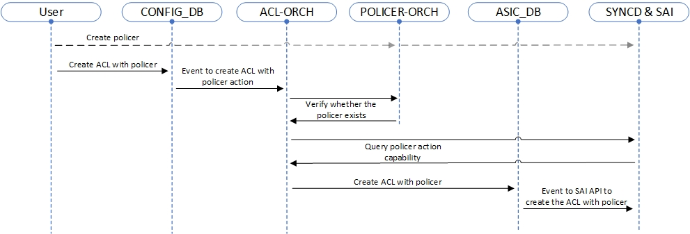

---
tags:
  - SONiC
  - Policer
  - ACL
---
## Policy-Based Metering in SONiC- [Policy-Based Metering in SONiC](#policy-based-metering-in-sonic)
- [Policy-Based Metering in SONiC- Policy-Based Metering in SONiC](#policy-based-metering-in-sonic--policy-based-metering-in-sonic)
  - [Revision](#revision)
  - [Scope](#scope)
    - [Out of Scope](#out-of-scope)
  - [Definitions/Abbreviations](#definitionsabbreviations)
  - [Overview](#overview)
  - [Requirements](#requirements)
    - [Functional Requirements](#functional-requirements)
  - [Scalability Requirements:](#scalability-requirements)
    - [CLI Requirements](#cli-requirements)
  - [Architecture Design](#architecture-design)
      - [*Image 1: ACL Configuration Flow Overview*](#image-1-acl-configuration-flow-overview)
  - [High-Level Design](#high-level-design)
    - [Modules and Sub-Modules](#modules-and-sub-modules)
      - [*Image 2: Configuration Flow Overview*](#image-2-configuration-flow-overview)
  - [SAI API](#sai-api)
    - [Using example:](#using-example)
  - [Configuration and Management](#configuration-and-management)
    - [Config DB Enhancements](#config-db-enhancements)
      - [Updated ACL Tables Table schema:](#updated-acl-tables-table-schema)
      - [Updated ACL Rules Table schema:](#updated-acl-rules-table-schema)
      - [Example for JSON config file with the new fields:](#example-for-json-config-file-with-the-new-fields)
    - [CLI Config Commands](#cli-config-commands)
    - [CLI Show Commands](#cli-show-commands)
    - [YANG Model Enhancements](#yang-model-enhancements)
  - [Warmboot and Fastboot Design Impact](#warmboot-and-fastboot-design-impact)
  - [Restrictions/Limitations](#restrictionslimitations)
  - [Testing Requirements/Design](#testing-requirementsdesign)
    - [Unit Test Cases](#unit-test-cases)
    - [System Test Cases](#system-test-cases)
    - [CLI Level Tests](#cli-level-tests)
    - [DB validation](#db-validation)
  - [Open/Action Items](#openaction-items)

---
### Revision

| Version | Date       | Author                       | Description   |
| ------- | ---------- | ---------------------------- | ------------- |
| 1.0     | 2024-10-13 | Shay Goldshmit (**Marvell**) | Initial Draft |

---
### Scope

This document describes the design of Policy Base Metering (PBM) feature in SONiC.

#### Out of Scope

- [Policer Counter](https://github.com/sonic-net/SONiC/blob/e3f439dcfe2857540a02e4449fce247d4167b621/doc/policer_counter/PolicerCounter-HLD.md#Architecture-Design) - display and check detailed policer statistics (number of packets marked or dropped based on their color).
- Creating and managing policers (part of the [Everflow](https://github.com/sonic-net/SONiC/blob/master/doc/everflow/SONiC%20Everflow%20Always-on%20HLD.pdf) HLD)
---
### Definitions/Abbreviations

| Term | Definition                         |
| ---- | ---------------------------------- |
| ACL  | Access Control List                |
| SAI  | Switch Abstraction Interface       |
| CIR  | Committed Information Rate         |
| CBS  | Committed Burst Size               |
| PIR  | Peak Information Rate              |
| PBS  | Peak Burst Size                    |
| DSCP | Differentiated Services Code Point |
| DP   | Drop Precedence                    |

---
### Overview

Policer in networking are responsible for **metering** (Monitoring the rate of traffic) and **marking** (Flagging traffic that exceeds defined limits) traffic based on predefined criteria.
By applying policers to ACL rules, SONiC can effectively control the flow of network traffic, ensuring fairness, optimizing bandwidth utilization, and preventing network congestion.

Usage examples:
- **Security**: Policy-Based Metering can be used to guard against network storms or DDoS attacks by limiting traffic volumes.
- **Quality of Service (QoS)**: It helps in prioritizing critical traffic (like VoIP or video streams) while limiting less important traffic (such as bulk data transfers).
- **Data Center**: ensure fair bandwidth distribution.

---
### Requirements
#### Functional Requirements
- Backward compatibility for existing ACL features - If policer is not set, the system will function as it did previously.
- Ability to config/remove/manage policers with ACL entries.
- Support policer types
	- **storm_control**: Used to prevent network storms by limiting the rate of broadcast, multicast, and unknown unicast traffic.
	- **srTCM (Single Rate Three Color Marker)**: Marks packets based on a single rate and three colors (green, yellow, red) to indicate compliance with the traffic profile.
	- **trTCM (Two Rate Three Color Marker)**: Marks packets based on two rates (committed and peak) and three colors to indicate compliance.
	- Support rate-limiting in terms of packets per second or bytes per second.
- Support all existing ACL types (ACL table types, ACL stages).
### Scalability Requirements:
- Support for multiple ACL entries with associated policers.
- Query and validate ASIC capabilities dynamically.
#### CLI Requirements
- Bind policers with ACL rules.
- Unbind policer from ACL rules.
- Show ACLs with policers
---
### Architecture Design

No SONiC architecture changes are required as the existing infrastructure is being used.
##### *Image 1: ACL Configuration Flow Overview*


---
### High-Level Design

#### Modules and Sub-Modules
- **SWSS**
	- ACL-Orch
		- Add/Remove/Mange ACLs.
		- Set or disable policer action.
		- Query from SAI the ACL actions capability.
		- As part of rule processing
		    - Parse and validate policer info.
    		- Allow policer action only when capability is enabled (SAI query).
	- Policer-Orch
		- Add/Remove/Mange Policers.

##### *Image 2: Configuration Flow Overview*




---
### SAI API

Use these **existing** SAI APIs for packet actions and policer association:

| SAI Attribute                           | Description                                                                 |
| --------------------------------------- | --------------------------------------------------------------------------- |
| SAI_ACL_ACTION_TYPE_PACKET_ACTION       | Action type (Forward, Drop, etc) that can be taken in that ACL entry        |
| SAI_ACL_ACTION_TYPE_SET_POLICER         | Action type (policer) that can be taken in that ACL entry                   |
| SAI_ACL_ENTRY_ATTR_ACTION_PACKET_ACTION | Action (Forward, Drop, etc) to be executed on packets matching the ACL rule |
| SAI_ACL_ENTRY_ATTR_ACTION_SET_POLICER   | Action (policer) to be executed on packets matching the ACL rule            |

#### Using example:
1. Define the possible actions for the ACL table:
  ```C++
  sai_attribute_t acl_table_attr[2];
  sai_acl_action_type_t action_list[2] = {SAI_ACL_ACTION_TYPE_PACKET_ACTION, SAI_ACL_ACTION_TYPE_SET_POLICER};
  ```
1. Specify that the rule action to be taken is policer:
```C++
sai_attribute_t acl_attribute;
acl_attribute.id = SAI_ACL_ENTRY_ATTR_ACTION_SET_POLICER;
acl_attribute.value.oid = policer_id;
```

---
### Configuration and Management

#### Config DB Enhancements

##### Updated ACL Tables Table schema:
- When a new ACL is created in the current SAI implementation, an action list that defines the actions that the ACL rules can be used is required.
  Until this feature was introduced, only default actions were supported, so SONiC addressed this by sending a default action list \[**defaultAclActionList**\] per table type.
- Since a new action is added, ACL Tables Table schema will be updated with a new **optional** action-list field **'ext_actions_list'** to accept list of actions.
- The 'ext_actions_list' actions will be appended to the defaultAclActionList in the ACL table creation..
  For example, if user configures **ext_actions_list**=\[**POLICER**, **EXT_ACTION_2**\] - the full action-list of that table will be \[**defaultAclActionList(table_type)**, **POLICER**, **EXT_ACTION_2**\]
```
  key                  = ACL_TABLE:name                            ; acl_table_name must be unique
  ;field               = value                         
  policy_desc          = 1*255VCHAR                                ; name of the ACL policy table description
  type                 = 1*255VCHAR                                ; type of acl table, every table type
                                                                   ; defines a specific set of actions.
                                                                   ; posible types:
                                                                   ; "L3"/"L3V6"/"L3V4V6"/"MIRROR"/"MIRROR_DSCP"/
                                                                   ; "MIRRORV6"/"PFCWD"/"MCLAG"/"MUX"/"DROP"
  ports                = [0-max_ports]*port_name                   ; the ports to which this ACL
                                                                   ; table is applied, can be emtry
                                                                   ; value annotations
  port_name            = 1*64VCHAR                                 ; name of the port, must be unique
  max_ports            = 1*5DIGIT                                  ; number of ports supported on the chip
* ext_actions_list     = ["POLICER"]                               ; additional action list - can be extended in the future
                                                                   ; with new actions. Can be empty for default behavior.
```
##### Updated ACL Rules Table schema:
- The ACL Rules Table schema will be updated with a new parameter "policer_name" with value of one of the existing policer object names.
  In addition, to make the existing actions behave more deterministic, they separated into groups that can be set 'undependably'.
- For example, you can set the actions
  \[**packet_action_policer**=True; **packet_action_do_not_nat**=True; **packet_action**="forward"\].
  This means that **not-NAT** packets will be **forward** after **policer** handling.
```
key: ACL_RULE_TABLE:table_name:rule_name              ; key of the rule entry in the table,
                                                      ; seq is the order of the rules
                                                      ; when the packet is filtered by the
                                                      ; ACL "policy_name".
                                                      ; A rule is always assocaited with a policy.
;field        = value           
priority      = 1*3DIGIT                              ; rule priority. Valid values range
                                                      ; could be platform dependent

* packet_action = "forward"/"drop"/"redirect"         ; option for actions when the rule are matched.
* packet_action_mirror = True/false                   ; it hould be a sub set of the table 'ext_actions_list' felid
* packet_action_do_not_nat = True/false       
* packet_action_policer = True/false          

* policer_name = 1*255VCHAR                           ; refer to the policer object name ("packet_action_policer = True").

redirect_action = 1*255CHAR                           ; redirect parameter ("packet_action = True")
                                                      ; This parameter defines a destination for redirected packets
                                                      ; it could be:
                                                      : name of physical port. Example: "Ethernet10"
                                                      : name of LAG port.      Example: "PortChannel5"
                                                      
mirror_action = 1*255VCHAR                            ; refer to the mirror session ("packet_action_mirror = True")
                                                      ; (only available to mirror acl table type)

ether_type    = h16                                   ; Ethernet type field
ip_type       = ip_types                              ; options of the l2_protocol_type
                                                      ; field. Only v4 is support for
                                                      ; this stage.
ip_protocol   = h8                                    ; options of the l3_protocol_type field
src_ip        = ipv4_prefix                           ; options of the source ipv4
                                                      ; address (and mask) field
dst_ip        = ipv4_prefix                           ; options of the destination ipv4
                                                      ; address (and mask) field
l4_src_port   = port_num                              ; source L4 port or the
l4_dst_port   = port_num                              ; destination L4 port
...
```

##### Example for JSON config file with the new fields:
```JSON
{
    "POLICER_TABLE|M_POLICER_7": {
        "meter_type": "packets",
        "mode": "tr_tcm",
        "color": "aware",
        "cir": "5000",
        "cbs": "5000",
        "green_packet_action": "forward",
        "red_packet_action": "drop"
    },
    
    "ACL_TABLE|Table_ID_#1": {
        "policy_desc": "Permit some traffic",
        "type": "L3",
        "ports": [
            "Ethernet2",
            "Ethernet4",
            "Ethernet7"
        ],
      * "ext_actions_list": "POLICER",
        "OP": "SET"
    },
    
    "ACL_RULE|Table_ID_#1|Rule_ID_#1": {
        "priority": "70",
        "packet_action": "FORWARD",
      * "packet_action_policer": "True",
      * "policer_name": M_POLICER_7,   
        "IP_PROTOCOL": "TCP",
        "SRC_IP": "10.2.130.0/24",
        "DST_IP": "10.5.170.0/24",
        "L4_SRC_PORT_RANGE": "1024-65535",
        "L4_DST_PORT_RANGE": "80-89",
        "OP": "SET"
    }
}
```
#### CLI Config Commands
```bash
# Add/Remove/Update policer --> no change
config policer add <name> --rate <rate> --burst <burst>
config policer remove <name>
config policer update <name> --rate <rate> --burst <burst>

# Add/Remove/Update ACL tables --> new field 'ext_actions_list'
config acl add table [OPTIONS] <table_name> <table_type> [--ext_actions_list <actions_list>]
# Add/Remove/Update ACL rules --> new field 'policer_name'
config acl update full [OPTIONS] [--table_name <table_name>] [policer_name] <acl_json_file_name>

# 'config load' command to configudre the new ACL --> the file contains the new proposal fields
config load acl_cfg.json
```
#### CLI Show Commands
```bash
# Show existing ACL tables --> no change
show acl table [OPTIONS] [TABLE_NAME]

# Show existing ACL rules --> no change
show acl rule [OPTIONS] [TABLE_NAME] [RULE_ID]
```
Example:
```
admin@sonic:~$ show acl table
Name         Type    Binding    Description          Stage    * Extended Actions    Status
-----------  ------  ---------  -------------------  -------    -----------------   --------
Table_ID_#1  L3      Ethernet2  Permit some traffic  Ingress    POLICER             Inactive
                     Ethernet4
                     Ethernet7


admin@sonic:~$ show acl rule
Table         Rule          Priority      Actions                    Match
--------      ------------  ----------    -------------------------  ----------------------------
Table_ID_#1   RULE_5        9995          REDIRECT: Ethernet8        IP_PROTOCOL: 126
                                        * POLICER: policer2

Table_ID_#1   RULE_6        9994          FORWARD                    L4_SRC_PORT: 179
                                        * POLICER: policer3

SNMP_ACL      DEFAULT_RULE  23            DROP                       ETHER_TYPE: 2048
```

#### YANG Model Enhancements

sonic-yang-models/yang-templates/sonic-acl.yang.j2:
```c++
    ...
    import sonic-policer {
        prefix policer;
    }
    ...
    container sonic-acl {
        container ACL_RULE {
            ...
            leaf PACKET_ACTION {
                  type enumeration {
                      enum DROP;
                      enum ACCEPT;
                      enum FORWARD;
                  }
              }

              leaf PACKET_ACTION_POLICER {
                  type stypes:boolean_type;
              }

              leaf PACKET_ACTION_MIRROR {
                  type stypes:boolean_type;
              }

              leaf PACKET_ACTION_DO_NOT_NAT {
                  type stypes:boolean_type;
              }

              leaf POLICER_ACTION {
                  when "../PACKET_ACTION_POLICER";
                  type leafref {
                      path "/policer:sonic-policer/policer:POLICER/policer:POLICER_LIST/policer:name";
                  }
                  description "Policer action applied when PACKET_ACTION_POLICER is True.";
              }

              leaf MIRROR_INGRESS_ACTION {
                  when "../PACKET_ACTION_MIRROR";
                  type leafref {
                      path "/sms:sonic-mirror-session/sms:MIRROR_SESSION/sms:MIRROR_SESSION_LIST/sms:name";
                  }
              }
              leaf MIRROR_EGRESS_ACTION {
                  when "../PACKET_ACTION_MIRROR";
                  type leafref {
                      path "/sms:sonic-mirror-session/sms:MIRROR_SESSION/sms:MIRROR_SESSION_LIST/sms:name";
                  }
              }
          }
        }
        ...

        container ACL_TABLE {
              ...
              leaf-list EXT_ACTIONS {
                  description "Additional action list for ACL table. If no action is chosen, the default is nothing.";
                  type enumeration {
                      enum POLICER;
                  }
              }
        }
```

sonic-yang-models/yang-templates/sonic-policer.yang.j2:
```c++
    ...
    import sonic-acl {
      prefix acl;
    }
    ...
    container sonic-policer {
        container POLICER {
        ...
          /* Constraint to prevent deletion of polocer that referenced by ACL rule.
              Note that new policer won't be referenced by any ACL rules initially */
            must "not(../acl:sonic-acl/acl:ACL_RULE/acl:ACL_RULE_LIST[acl:POLICER_ACTION=current()/name])" {
                error-message "Policer cannot be deleted when referenced by an ACL rule.";
            }
        }
    }
```
---
### Warmboot and Fastboot Design Impact
N/A

---
### Restrictions/Limitations

- Policers must be supported
- PRE/POST INGRESS stage isn't supported (not supported by the existing ACL creation logic)

---
### Testing Requirements/Design
#### Unit Test Cases
- Test ACL-Orchagent and Policer-Orchagent logic for correct processing.
#### System Test Cases
- Ensure correct packet marking based on policer configurations.
- Warm/Fast reboot tests to check the changes do not break these features.
#### CLI Level Tests
- Verify command run successfully with valid parameter enable/disable.
-  Verify command abort with invalid policer parameter.
- Verify command output.
#### DB validation
- Verify CONFIG DB is correctly updated.
---
### Open/Action Items
- Are there specific ASIC platforms with limitations for this feature?
- ACL-Loader utility uses the an external python library (openconfig_acl) that rely on pre-defined structured models.
  In order to support the new 'policer_action' per rule, openconfig_acl implementation need to be changed.